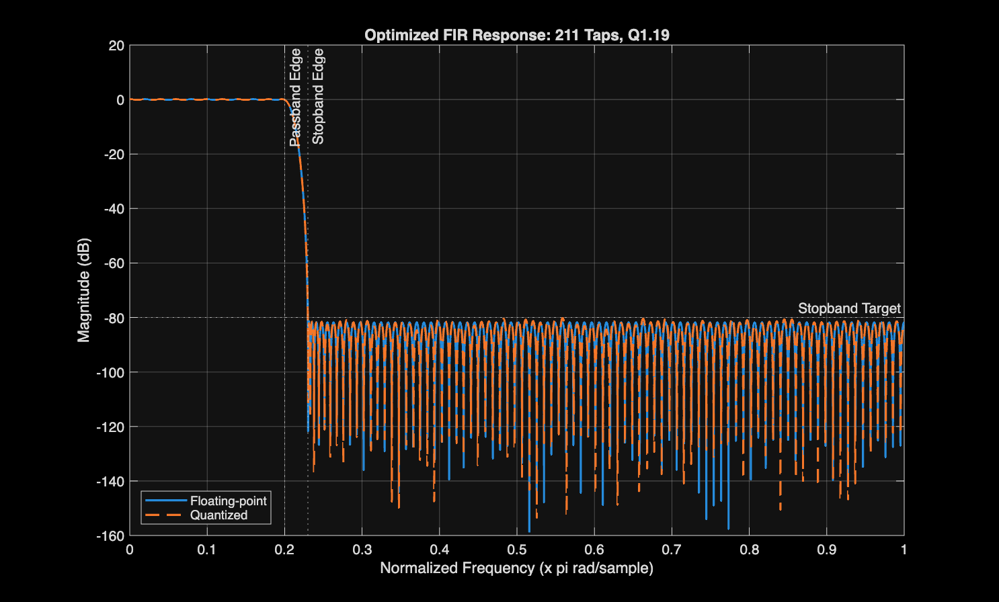
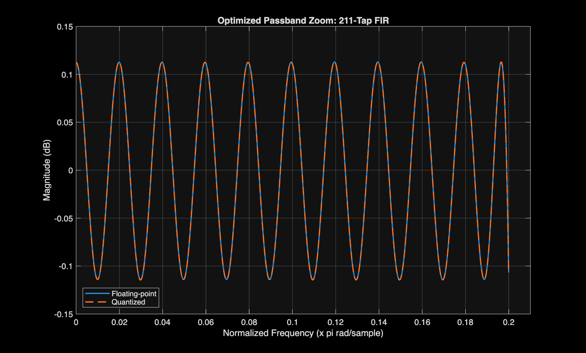
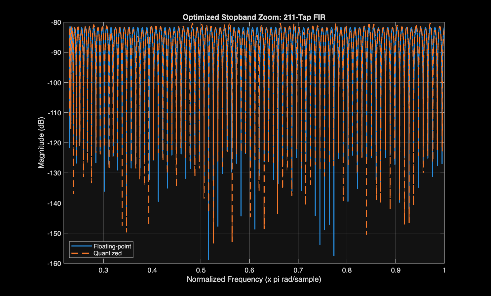
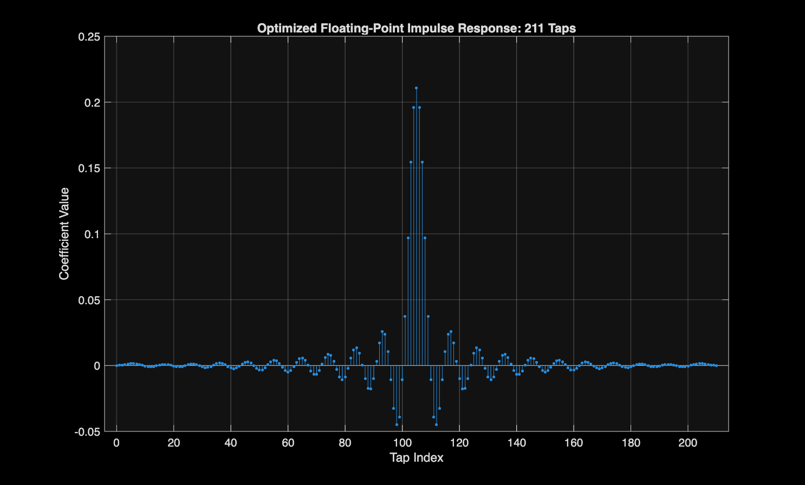
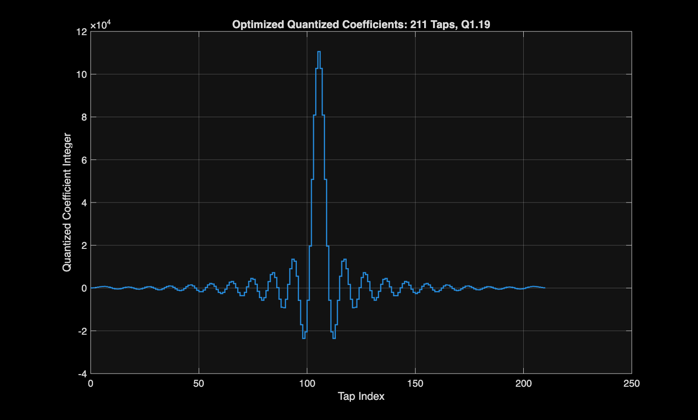
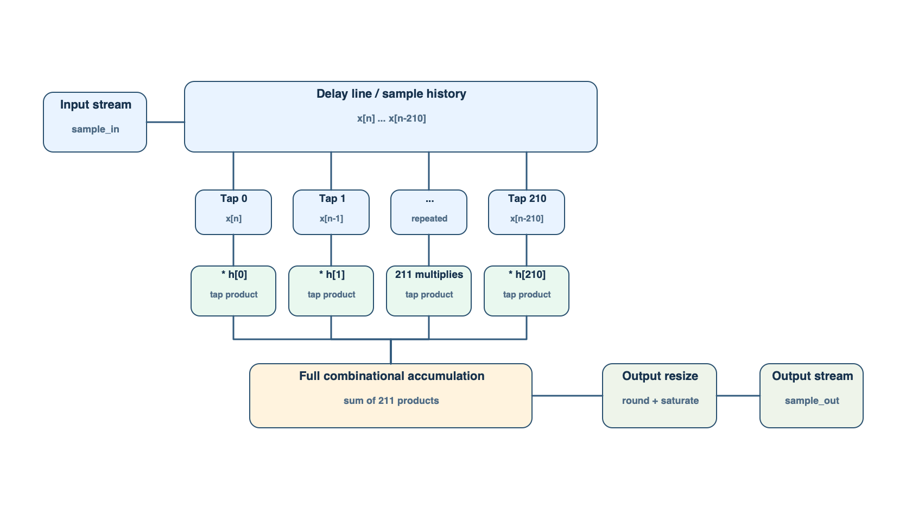
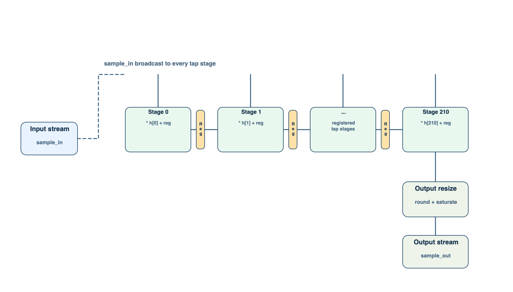
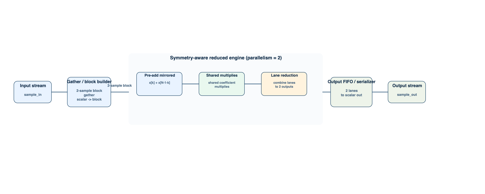
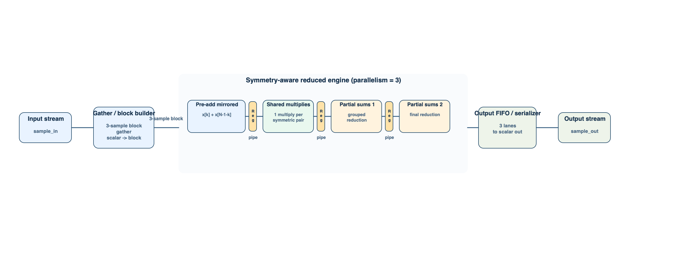

# Optimized FIR Filter Design and FPGA Implementation

Julian Tiana

## 1. Introduction

This report covers the final optimized low-pass FIR filter prepared for the course project. The assignment target is a transition band from `0.20pi` to `0.23pi` rad/sample with at least `80 dB` stopband attenuation. MATLAB is used for filter design and coefficient quantization, and SystemVerilog is used for the hardware implementations.

The final optimized design uses `211` taps, equiripple band weights `[1, 160]`, and signed `20-bit` coefficients in `Q1.19` format. Five hardware architectures are implemented and compared on a Cyclone V FPGA.

## 2. MATLAB FIR Design

### 2.1 Final design point

The assignment starts from a `100`-tap low-pass FIR and allows the tap count to increase if needed. The final optimized design point used here is:

- taps: `211`
- passband edge: `0.20pi`
- stopband edge: `0.23pi`
- stopband target: `80 dB`
- coefficient format: `20-bit signed`, `Q1.19`
- equiripple band weights `[1, 160]`

The MATLAB scripts that reproduce this design are:

- `matlab/search_optimal_assignment_tradeoff.m`
- `matlab/design_fir_equiripple_optimized.m`

### 2.2 MATLAB flow

MATLAB is used in two steps. First, `matlab/search_optimal_assignment_tradeoff.m` sweeps tap count, stopband weight, and coefficient width to locate feasible design points. Second, `matlab/design_fir_equiripple_optimized.m` regenerates the chosen equiripple filter, measures the floating-point response, quantizes the coefficients, and exports the plots and coefficient files used by the RTL.

This flow leads to the `211`-tap, `Q1.19` coefficient set used in the final design. The selected point keeps the quantized stopband peak below `-80 dB` while avoiding wider coefficients than necessary. In practical terms, the MATLAB stage decides the taps and coefficient values, while the RTL stage reuses those fixed coefficients exactly.

## 3. Frequency Response, Quantization, and Overflow Handling

The optimized FIR still satisfies the original stopband requirement after quantization.

Figure 1 shows the full floating-point and quantized response.

<p align="center"></p>

Figure 1 is the main frequency-domain check for the design. The floating-point and quantized curves remain close across the full band, and the stopband stays below the required attenuation level after coefficient quantization.

Figure 2 shows the optimized passband zoom.

<p align="center"></p>

Figure 2 isolates the passband ripple. This view makes the quantization effect easier to see than the full response plot, since the difference between the floating-point and quantized curves is very small but still measurable.

Figure 3 shows the optimized stopband zoom.

<p align="center"></p>

Figure 3 focuses on the stopband region, which is the key assignment requirement. The quantized filter still stays below `-80 dB`, so the implemented coefficient set remains valid for the project target.

Figure 4 shows the floating-point impulse response of the optimized FIR.

<p align="center"></p>

Figure 4 shows the impulse response of the final filter. The coefficient sequence is symmetric about the center tap, which is why the reduced-complexity architectures can use mirrored sample pairs in the hardware.

Figure 5 shows the quantized coefficient integers used to generate hardware coefficients.

<p align="center"></p>

Figure 5 shows the integer coefficient values after quantization. These are the values converted into the shared coefficient package used by the SystemVerilog RTL.

The floating-point and quantized responses both satisfy the stopband requirement. The measured floating-point stopband peak is `-81.45 dB`, and after quantization the stopband peak is `-80.15 dB`. The passband ripple changes only slightly, from `0.2274 dB` to `0.2275 dB`, so the main effect of quantization is small and acceptable for this design.

Table 1 gives a more quantitative view of the quantization error.

| Metric | Value |
| --- | ---: |
| Quantization step (`Q1.19`) | `1.907e-6` |
| Max absolute coefficient error | `9.36e-7` |
| Mean absolute coefficient error | `5.10e-7` |
| RMS coefficient error | `5.74e-7` |
| Coefficient error SNR | `94.75 dB` |
| DC gain error | `-1.33e-5` |
| Passband ripple change | `+8.73e-5 dB` |
| Stopband peak degradation | `+1.30 dB` |
| Max passband magnitude difference | `0.00024 dB` |

The coefficient error is small relative to the `Q1.19` step size. The worst coefficient error stays below half an LSB, the DC gain change is negligible, and the passband ripple shift is essentially invisible at normal plot scale. The main measurable quantization effect is the `1.30 dB` loss in stopband margin, but the final quantized response still clears the `80 dB` requirement.

Figure 5 also shows that the quantized coefficients retain the expected symmetry about the center tap, which is important for the reduced-complexity architectures.

Overflow is handled in hardware by using widened product and accumulation paths and then applying rounding and saturation when the result is resized back to the output width. This avoids wraparound at the output and keeps the fixed-point implementation consistent with the intended filter behavior.

## 4. Mathematical Formulation

### 4.1 FIR equation

For an `N`-tap FIR filter, the output is

```text
y[n] = sum_{k=0}^{N-1} h[k] x[n-k]
```

For this optimized design:

- `N = 211`
- `h[k]` are the quantized FIR coefficients
- `x[n-k]` are the current and delayed input samples

### 4.2 Symmetry relation

The optimized coefficient set remains approximately linear-phase and symmetric, so the hardware can exploit

```text
h[k] = h[N-1-k]
```

This allows the FIR to be rewritten as

```text
y[n] = sum_{k=0}^{(N-1)/2 - 1} h[k] ( x[n-k] + x[n-(N-1-k)] ) + h[(N-1)/2] x[n-(N-1)/2]
```

for the odd-tap case. Since `211` is odd, this form includes one center tap that is not paired.

### 4.3 Why the optimized design is hardware-friendly

For the `211`-tap odd-length FIR, symmetry-aware hardware can reduce the filter body to `105` mirrored coefficient pairs plus one center tap. Combined with `20-bit` coefficients, this keeps the arithmetic practical for FPGA implementation while still meeting the frequency-domain target. This does not automatically guarantee timing closure, but it gives the pipelined and reduced-complexity architectures a more manageable arithmetic workload.

## 5. RTL Structure and Hardware Architectures

The RTL is organized around one shared coefficient package, five top-level filter modules, and two shared support engines for the reduced-complexity designs:

- `rtl/include/fir_coeffs_pkg.sv` - quantized optimized coefficients used by every RTL variant
- `rtl/src/fir_filter.sv` - direct-form optimized FIR
- `rtl/src/fir_filter_pipelined.sv` - serial pipelined optimized FIR
- `rtl/src/fir_filter_l2_reduced.sv` - reduced-complexity `L=2` wrapper
- `rtl/src/fir_filter_l3_reduced.sv` - reduced-complexity `L=3` wrapper
- `rtl/src/fir_filter_pipelined_l3_reduced.sv` - pipelined reduced-complexity `L=3` wrapper
- `rtl/src/fir_filter_parallel_reduced.sv` and `rtl/src/fir_filter_parallel_reduced_pipelined.sv` - shared engines used by the reduced architectures

The checked-in coefficient package in `rtl/include/fir_coeffs_pkg.sv` is regenerated from the optimized integer coefficient file. All five top-level designs use the same scalar interface: `clk`, `rst_n`, `sample_valid`, `sample_in`, `sample_out_valid`, and `sample_out`. The common regression testbench in `tb/fir_filter_required_regression_tb.sv` checks all five architectures against the same reference output stream.

The code is intentionally split so the architecture differences are easy to follow. The direct-form and serial pipelined designs are self-contained top-level modules. The reduced-complexity designs use thin top-level wrappers plus shared engine modules, which keeps the symmetry-aware and pipelined block logic in one place instead of duplicating it across multiple files.

The architecture figures in this section are simplified views of the actual SystemVerilog structure. Each figure corresponds to a top-level module, and the main blocks in each figure map directly onto the logic in the RTL.

### 5.1 Direct form: `fir_filter`

Figure 6 shows the direct-form implementation.

<p align="center"></p>

The direct-form architecture stores the scalar sample history in a delay line, multiplies each delayed sample by its coefficient, and then sums all `211` products in one combinational path. This is the most direct implementation of the FIR equation, but it also creates the deepest arithmetic path in the design set.

In the code, this structure appears in `rtl/src/fir_filter.sv` as the `delay_line` storage, the multiply loop over all taps, and the final `resize_and_saturate` function used before the output register.

### 5.2 Serial pipelined form: `fir_filter_pipelined`

Figure 7 shows the serial pipelined implementation.

<p align="center"></p>

This version keeps the same scalar input/output interface, but moves the arithmetic into a chain of registered partial-sum stages. The current input sample is broadcast across the tap stages, and each stage performs one multiply-add before passing a registered partial sum forward. The result is a much shorter critical path than the direct-form sum.

In `rtl/src/fir_filter_pipelined.sv`, this structure is represented by the `stage_reg[]` array and the logic that computes `stage_next[]` and `output_acc_next`. The figure is therefore a direct summary of the registered tap-stage chain used in the code.

### 5.3 Reduced-complexity L=2 form: `fir_filter_l2_reduced`

Figure 8 shows the reduced-complexity `L=2` architecture.

<p align="center"></p>

The `L=2` design first gathers two scalar samples into a small parallel block. Inside the reduced engine, symmetric sample pairs are pre-added so that mirrored coefficients share one multiplication instead of using two separate multipliers. The two-lane results are then reduced and serialized back into a scalar stream. This lowers arithmetic redundancy, but the reduction path is still unpipelined.

This code structure is split across two files. `rtl/src/fir_filter_l2_reduced.sv` is a small top-level wrapper, while `rtl/src/fir_filter_parallel_reduced.sv` contains both the scalar gather/serialize wrapper and the reduced block engine itself. In other words, the diagram shows the architectural idea, and the shared engine file holds the logic that makes the symmetry reuse happen.

### 5.4 Reduced-complexity L=3 form: `fir_filter_l3_reduced`

Figure 9 shows the reduced-complexity `L=3` architecture.

<p align="center"></p>

The `L=3` design applies the same symmetry-aware idea to three-sample blocks. A gather stage collects three scalar inputs, the reduced engine reuses symmetric coefficients through pre-add and shared-multiply steps, and the three lane results are serialized back to the scalar output. This raises block throughput, but the deeper unpipelined reduction tree makes timing closure harder.

As with the `L=2` case, the top-level wrapper is small and most of the logic lives in `rtl/src/fir_filter_parallel_reduced.sv`. The difference is the parameter choice `PARALLELISM = 3`, which changes the gather width and the size of the reduced block computation. This is why Figures 8 and 9 look similar, while the throughput and timing behavior differ.

### 5.5 Pipelined reduced-complexity L=3 form: `fir_filter_pipelined_l3_reduced`

Figure 10 shows the pipelined reduced-complexity `L=3` architecture.

<p align="center"></p>

This architecture keeps the same `L=3` block processing flow, but inserts pipeline registers between the major reduction stages. The pre-add and shared-multiply structure is preserved, while the internal reduction tree is split into shorter timing stages before the three-lane block is serialized. This is the highest-throughput architecture in the set and the only parallel architecture that closes timing at `100 MHz`.

In the RTL, `rtl/src/fir_filter_pipelined_l3_reduced.sv` is again a thin wrapper, while `rtl/src/fir_filter_parallel_reduced_pipelined.sv` holds the pipelined engine and scalar stream wrapper. The staged arrays for product terms and partial sums are the code-level counterpart of the pipeline stages shown in Figure 10.

## 6. Quartus Results (Cyclone V 5CGXFC9E6F35C7, 100 MHz target)

| Architecture | Fitter Status | Registers | DSPs | 100 MHz Timing | Worst Slow 85C Setup Slack | Total Thermal Power |
| --- | --- | ---: | ---: | --- | ---: | ---: |
| `fir_filter` | Successful | 3,393 | 205 | Fails | `-17.362 ns` | 720.56 mW |
| `fir_filter_pipelined` | Successful | 9,667 | 103 | Passes | `+1.965 ns` | 639.29 mW |
| `fir_filter_l2_reduced` | Successful | 3,574 | 206 | Fails | `-19.217 ns` | 788.45 mW |
| `fir_filter_l3_reduced` | Successful | 3,720 | 309 | Fails | `-24.871 ns` | 848.44 mW |
| `fir_filter_pipelined_l3_reduced` | Successful | 24,304 | 159 | Passes | `+0.324 ns` | 1,104.29 mW |

All five architectures fit the target device. Only the pipelined designs meet the `100 MHz` clock constraint. The reduced-complexity `L=3` design shows the worst slack in the unpipelined case because the parallel reduction tree stays in one long combinational path. Adding pipeline registers in `fir_filter_pipelined_l3_reduced` fixes the timing issue, but increases register count substantially.

Power estimates use Quartus default toggle rates, so they should be treated as approximate. ALM counts are not available in the Lite Edition reports, so the area discussion is based on registers and DSP usage.

From an implementation point of view, the key result is that the design space is not limited by fit. All five versions compile onto the selected Cyclone V device. The real separator is timing: once the arithmetic path is shortened with registers, the design reaches the target clock.

### Throughput-normalized comparison (pipelined designs only)

| Architecture | Fmax | Parallelism | Throughput | mW/MSPS | Regs/MSPS | DSPs/MSPS |
| --- | ---: | ---: | ---: | ---: | ---: | ---: |
| `fir_filter_pipelined` | 124.5 MHz | 1 | 124.5 MSPS | 5.1 | 77.6 | 0.83 |
| `fir_filter_pipelined_l3_reduced` | 103.3 MHz | 3 | 310.0 MSPS | 3.6 | 78.4 | 0.51 |

The pipelined `L=3` design delivers about `2.5x` the throughput of the serial pipelined design for about `1.7x` the power and `2.5x` the registers. Its DSP use per output sample is lower because symmetry and pipelining allow the arithmetic to be reused more effectively.

## 7. Further Analysis and Conclusion

The optimized design meets the assignment stopband target after fixed-point quantization, and the MATLAB results show that the chosen `Q1.19` coefficient format preserves the required attenuation with only a small change in ripple. The direct-form and unpipelined reduced-complexity architectures all fit on the target device, but none of them meet the `100 MHz` timing goal because their combinational arithmetic paths are still too deep.

The serial pipelined design shows that distributing the arithmetic across registered partial-sum stages is enough to close timing while keeping a simple scalar interface. The pipelined `L=3` reduced-complexity architecture goes further by combining symmetry reuse, block processing, and internal pipelining. That design gives the highest throughput of the five architectures while still meeting timing on the selected Cyclone V device.

In short, the optimized project covers the full assignment flow: MATLAB FIR design, quantization, overflow handling, multiple hardware architectures, and FPGA implementation results. If a simpler timing-closed design is preferred, `fir_filter_pipelined` is the better choice. If throughput is the main goal, `fir_filter_pipelined_l3_reduced` is the strongest result in this set.

For a GitHub-facing presentation, that last point is probably the clearest summary of the work: the project does not stop at filter design, but carries one optimized coefficient set all the way through fixed-point hardware implementation, verification, and FPGA results.
